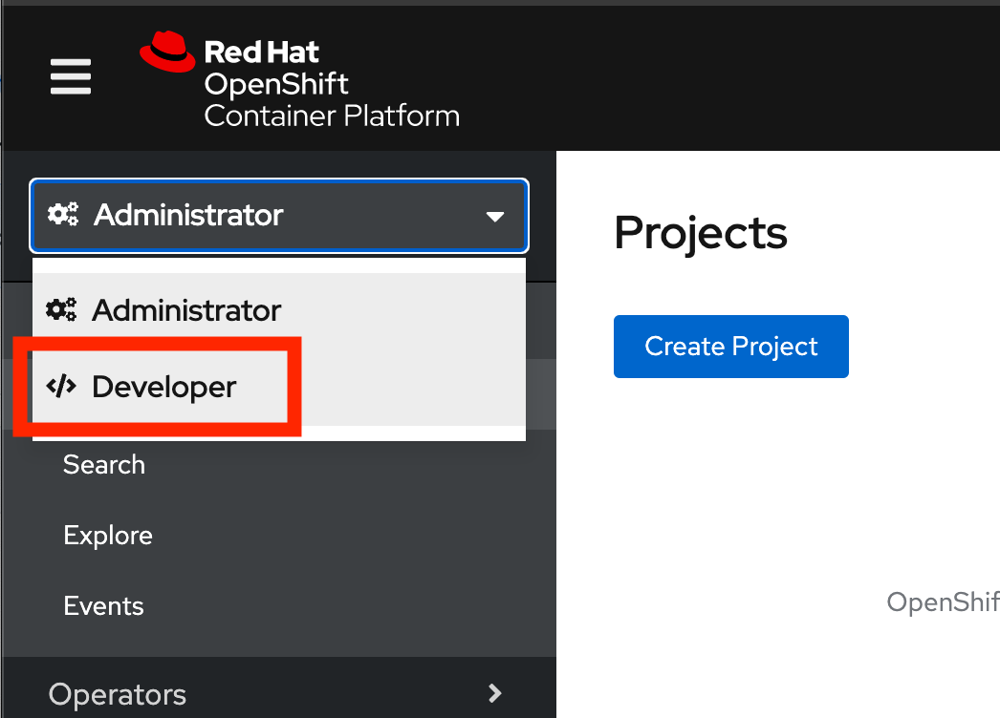
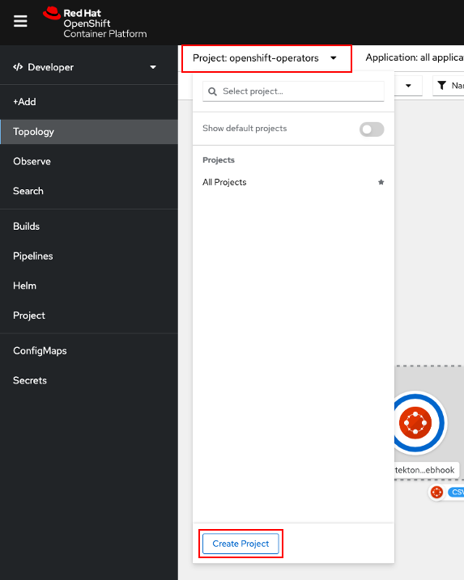
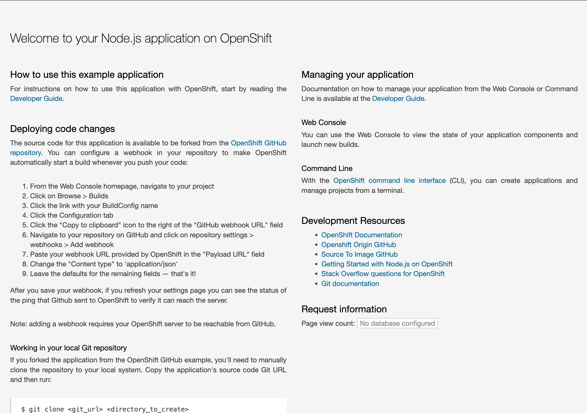
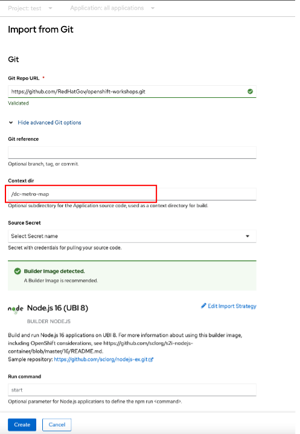
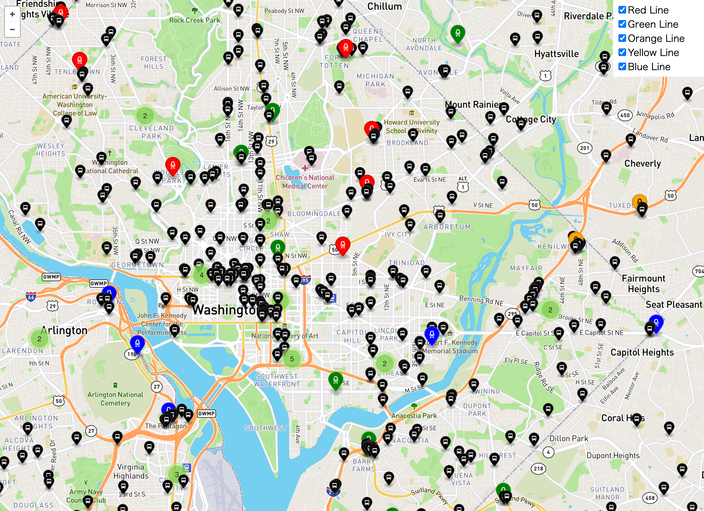
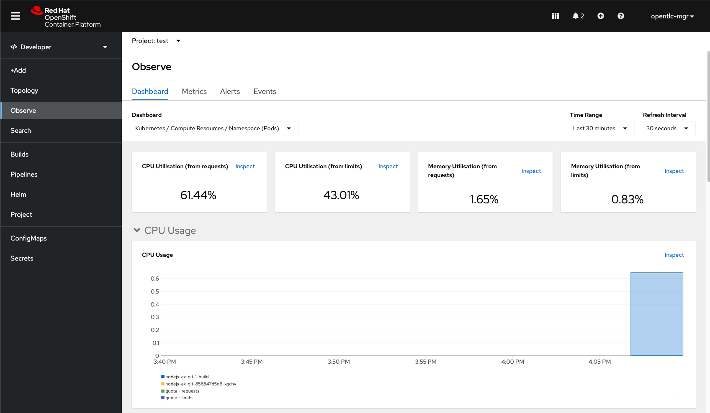
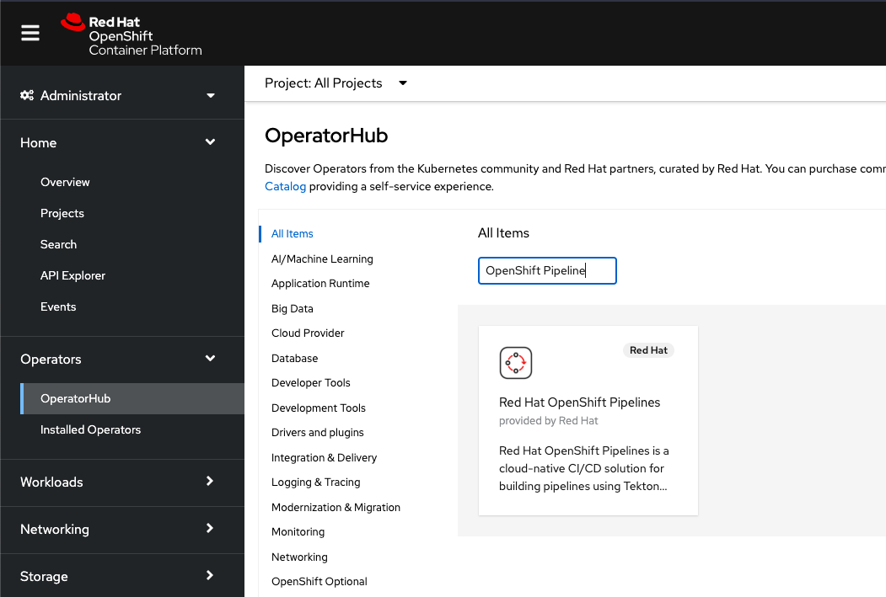
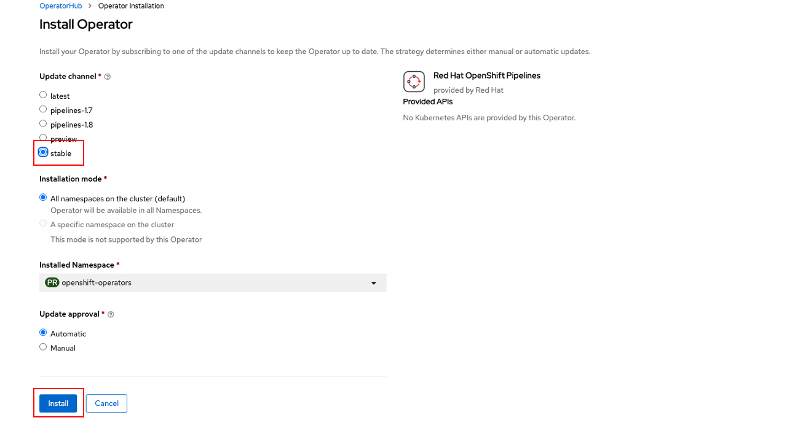

# OpenShift ユーザエクスペリエンス 

## シナリオ

このラボでは、Red Hat OpenShift Container Platform でアプリケーションをデプロイするデモを行います。デプロイしたアプリの詳細情報を閲覧します。
また、OperatorHub から Operator をインストールします。

### ゴール
* Web コンソールのパースペクティブ(DeveloperとAdministrator)を理解
* Gitリポジトリからアプリケーションをビルドしてデプロイ
* デプロイしたアプリを、ウェブコンソールのトポロジービューを通して確認
* OperatorHub から Operator をインストール


---
## Developer パースペクティブ

OpenShift Container PlatformのWebコンソールには、Administrator パースペクティブとDeveloperパースペクティブの2つのパースペクティブがあります。Developerパースペクティブでは、開発者のユースケースに特化したワークフローを提供します。

* **Developerパースペクティブに切り替えます。**

    アプリケーションを作成するためのオプションを持つTopologyビューが表示されます。


<div style="text-align: center;">Developerパースペクティブ</div>

<br>

## Project 作成

プロジェクトによって、あるユーザーのコミュニティが他のコミュニティから切り離された状態でコンテンツを整理・管理できます。プロジェクトはKubernetesネームスペースに対するOpenShiftの拡張で、ユーザーのセルフプロビジョニングを可能にする機能を追加したものです。 ほとんどの場合に互換性があります。

* **Project ドロップダウンメニューをクリック -> Create Project を選択します。**


<div style="text-align: center;">Project作成</div>

<br>

> NOTE:
>
> 異なるプロジェクトはそれぞれに対応した異なるユーザー権限とクォータを持つことができます

* *Name* を `<英字氏名>-test` として、プロジェクトを作成します。 例） `yamadataro-test`

    プロジェクトが `<英字氏名>-test` に切り替わったことを確認します。

   　プロジェクト名はOpenShiftクラスタ内で一意である必要があります。


---
## アプリケーションデプロイメント

Web コンソールの Developer パースペクティブでは、Add ビューからアプリケーションおよび関連サービスを作成できます。OpenShift Container Platform にデプロイするためにはいくつかのオプションがあります（例 Dockerfile、Git、Catalog、YAMLなど）。

* *Devfile*：これはDevfilev2仕様を使用してアプリケーションスタックを作成します。devfile.yamlリポジトリには、Devfilev2形式で名前が付けられたファイルが含まれている必要があります。
* *Dockerfile*：これにより、既存のDockerfileからコンテナイメージが作成されます。
* *ビルダーイメージ*：これは、Source-to-Imageと呼ばれるメカニズムを使用して、ソースコードから直接コンテナーイメージを自動的に作成します。

本手順では、GitHub にある既存のコードベースを利用して、OpenShift Container Platform上でアプリケーションを作成、構築、デプロイします。Developerパースペクティブでアプリケーションを作成するための *Import from git* オプションを使います。 


### アプリケーションの作成
* **Add ビューで `Import From Git` をクリックし、Import from Git フォームを表示します。**


<div style="text-align: center;">Developer パースペクティブ</div>

<br>


* **Git セクションで、アプリケーションの作成に使用するコードベースの Git リポジトリー URL を入力します。**

```
https://github.com/sclorg/nodejs-ex.git
```


<div style="text-align: center;">Import from git</div>

<br>

* **`Edit Import Strategy` をあえて選択し、適切なビルダーイメージが検出されているかを確認します。**
    * **Builder セクション**で、URL の検証後に、自動的に選択されます（スターのマークが付きます）。
    * ビルダーイメージが自動検出されていない場合は、ビルダーイメージを選択します。必要に応じて、Builder Image Version のドロップダウンリストを使用してバージョンを変更できます。

* **General セクションで、以下を確認します（特に変更不要です）。**

    * **Application** ：アプリケーションを分類するために一意の名前 (nodejs-ex-app など) を入力します。
    * **Name** ：このアプリケーション用に作成されたリソースを分類するために一意な名前を入力します。これは Git リポジトリー URL をベースとして自動的に設定されます。

* **Resources セクションで、デフォルトのリソース `Deployment` を選択します** 

> NOTE:
> 
> OpenShift Deployment Configsに加えて、Kubernetes _Deployments_ もサポートされています。

* **その他の設定は変更せず、`Create` をクリックします。**

> NOTE :
>
> Knative Service オプションは、Serverless Operator がクラスターにインストールされている場合にのみ、Import from git 形式で表示されます。

=== Topology ビュー

. Web コンソールのDeveloperパースペクティブにあるTopologyビューでは、プロジェクト内のすべてのアプリケーション、そのビルドステータス、およびそれらに関連するコンポーネントとサービスを視覚的に表示します。


<div style="text-align: center;">Topology ビュー</div>

<br>
[NOTE]
====
グラフィカルな表示が表示されない場合は、Web コンソールの右上にある「Topologyビュー」アイコンをクリックします。
    


<div style="text-align: center;">Topology ビューの切り替え</div>

<br>

アプリケーションをビルドすると、Runningと表示されます。

<div align="center">

</div>
<div style="text-align: center;">Running</div>

<br>

+
. *説明*: Developer パースペクティブの左側のナビゲーションパネルを使用すると、Topology ビューに移動できます。アプリケーションを作成したら、Topology ビューに自動的に移動します。ここでは、アプリケーション Pod のステータスの確認、パブリック URL でのアプリケーションへの迅速なアクセス、ソースコードへのアクセスとその変更、最終ビルドのステータスの確認ができます。ズームインおよびズームアウトにより、特定のアプリケーションの詳細を表示することができます。
. *説明*: Podの状態やフェーズは、色で区別され、ツールチップで次のように表示されます。Running (image:images/03_1_pod_running.png[]), Not Ready (image:images/03_1_pod_not_ready.png[]), Warning (image:images/03_1_pod_warning.png[])、Failed(image:images/03_1_pod_failed.png[])、Pending (image:images/03_1_pod_pending.png[])、Succeeded(image:images/03_1_pod_succeeded.png[])、Terminating(image:images/03_1_pod_terminating.png[])、またはUnknown(image:images/03_1_pod_unknown.png[])のいずれかになります。 Podの状態の詳細については、Kubernetesのドキュメントを参照してください。

. *説明*: アプリケーションを作成し、イメージがデプロイされると、ステータスは Pending と表示されます。アプリケーションをビルドすると、Runningと表示されます。
+

以下のように、異なるタイプのリソースオブジェクトのインジケーターと共に、アプリケーションリソース名が追加されます。


* *D*: Deployment
* *DC*: Deployment Configs
* *SS*: StatefulSet
* *DS*: Daemonset

**アプリケーションの中心のロゴをクリックすると、右側から詳細画面が表示され、関連するリソースを閲覧することができます。**


<div style="text-align: center;"></div>

<br>

* **Route からアプリケーションにアクセスしてみてください。**


<div style="text-align: center;">nodejs-ex アプリ</div>

<br>

> NOTE :
>
> Advanced Options セクションでは、**Create a route to the application** がデフォルトで選択されるため、公開されている URL を使用してアプリケーションにアクセスできます。
> アプリケーションをパブリックルートに公開したくない場合は、チェックボックスをクリアできます。

---
## アプリケーションデプロイメント (dc-metro-map)
各自で実施してみてください。

### アプリケーションの作成
* **以下の設定で、アプリケーションをデプロイしてみてください。**
    * GitHub レポジトリ URL：
    ```
    https://github.com/RedHatGov/openshift-workshops.git
    ```

    * "Show advanced Git options"を表示し、表示されたメニューから"Context dir"を設定します：
    ```
    /dc-metro-map
    ```

* **その他の設定は変更せず、`Create` をクリックします。**


<div style="text-align: center;">openshift-workshopsアプリ</div>

<br>

* **Route からアプリケーションにアクセスしてみてください。**


<div style="text-align: center;">openshift-workshopsアプリ</div>

<br>


## Monitoring ビューの確認 (OpenShift Monitoring)

Red Hat は最近、モニタリング機能(Kibana)をWebコンソールに統合しました。プロジェクト全体のメトリクスとイベントについてはこちらからご覧ください。

* 左側のパネルで **Observe**をクリックします。


<div style="text-align: center;"></div>

<br>

* *Dashboard* タブ 

    Dashboardタブは、プロジェクトのメトリクスをまとめて表示します。

* *Metrics* タブ 

    Metricsタブは、Prometheus Metricsのカスタムグラフを作成することができます。

* *Events* タブ 

    Eventsタブは、報告されたイベントが一つのストリームとして表示され、フィルターできます。


---
## Pod の確認 (Readiness Probe / Liveness Probes)

Administrator パースペクティブから確認します。

* **左側のメニューから、 *Workloads -> Pods* を選びます**
    * プロジェクトの *Pods* ページは、プロジェクトの中で現在実行中の全てのPodを表示します。
        * `Running`, `Pending` などコンテナの状態を確認することができます。
        *  *Ready*  カラムは Readiness チェックにもとづいたコンテナ内アプリケーションの状態が表示されます。

* **`openshift-workshops-git-XXXXX` Pod をリストから選びます。**
    * それぞれの *Pod* ページでは以下が表示されます。
        * *Containers* セクション
            * イメージ名とコンテナの状態を含む情報が表示されます
            * Podのステータスとそれをホストする OpenShift ノード
    
    
* **`openshift-workshops-git` という名前のコンテナをクリックして *Container Details* ページを開く。**
    * アプリケーションコンテナの *Readiness Probe* と *Liveness Probes* を確認します。
    > NOTE:
    > 
    > 該当のアプリケーションでは、Readiness Probe/Liveness Probesが設定されていません。
    > 詳細な利用法は[こちら](https://developers.redhat.com/blog/2020/11/10/you-probably-need-liveness-and-readiness-probes#what_about_identical_liveness_and_a_readiness_probes_)の情報を参考にしてみてください。

* ***メトリクス* タブ を参照する**
    * メモリ、CPU などリソースの使用量が表示されます。
    
    <div style="text-align: center;">Memory Usage, CPU Usage, Filesystem のグラフ</div>

<br>

* **そのほか、各タブを見ていきます。**
    * *Logs* タブ 
        * Podのメッセージはここに表示され、更新されるにしたがって追跡することができます。
        * 更新によるログの出力を一時停止および再開することができます。

    * *Terminal* タブ 
        * デバッグやテストのためにコンテナ内でコマンドを実行することができます。

    * *Events* タブ 
        * このリストはPodのDeploymentで何かがおかしいかを探したり、イベントの連鎖を追跡したりするために使えます。

## OperatorHub から Operatorのインストール
Administrator パースペクティブから確認します。

### OpenShift Pipelineのインストール

* **OpenShift Pipelineをインストール**
    * Administratorパースペクティブの下の左側のメニューから、Operators → OperatorHubに移動します。
    * 検索ボックスで`OpenShift Pipeline`を検索し、 表示された結果から`Red Hat OpenShift Pipelines`をクリックします。


<div style="text-align: center;">OperaterHub画面1</div>

<br>

* **説明ビューで、`Install` をクリックして、すべてのインストール設定を確認します。**


<div style="text-align: center;">OperaterHub画面2</div>

<br>

* **Update Channelが `stable` に設定されていることを確認し、 `Install` をクリックしてOperatorのインストールを開始します。**


<div style="text-align: center;">OperaterHub画面3</div>

<br>

* **数秒後、以下のような画面が表示され、インストールが正常に完了します。また、Installed Operatorsの画面の[Status]列を確認することで、インストールステータスが成功であるかどうかを確認できます。**


<div style="text-align: center;">OperaterHub画面4</div>

<br>

---
## 追加のデモ （オプション）

興味のある Operator をインストールしてみてください（OpenShift Logging などなど）。
